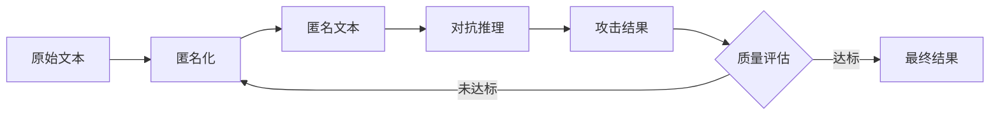

# 毕业设计写作记录卡（二）

**学生姓名**: [待填写]
**学号**: [待填写]
**专业班级**: [待填写]
**指导教师**: [待填写]
**记录日期**: 2024年3月

---

## 一、文献综述进展

### 1.1 核心论文精读

#### 《Large Language Models are Advanced Anonymizers》
- **发表会议**: ICLR 2025（国际学习表征会议）
- **研究机构**: ETH Zurich
- **核心贡献**:
  1. 提出基于LLM的匿名化范式
  2. 设计对抗推理评估框架
  3. 在多个数据集验证有效性

- **方法论**:
  ```
  原始文本 → LLM匿名化 → 对抗推理 → 隐私/效用评估
  ```

- **关键发现**:
  - GPT-4在匿名化任务上显著优于传统方法
  - 多轮对抗训练可提升隐私保护效果
  - 需要平衡隐私保护与文本实用性

### 1.2 相关研究脉络

| 研究方向 | 代表工作 | 技术特点 |
|----------|----------|----------|
| 规则方法 | Presidio | 基于规则和NER |
| 统计方法 | 差分隐私 | 数学噪声注入 |
| 深度学习 | BERT-NER | 序列标注 |
| **LLM方法** | **本论文** | **上下文理解+生成** |

### 1.3 中文资源调研

1. **国产大模型**:
   - DeepSeek-V3（深度求索）
   - Qwen（通义千问）
   - 文心一言、讯飞星火

2. **API可用性**:
   - ✅ DeepSeek API：开放申请
   - ✅ Qwen API：阿里云服务
   - ✅ 成本可控：约¥0.001/1K tokens

---

## 二、需求分析

### 2.1 功能性需求

#### FR1: 文本匿名化
- **输入**: 原始文本（Reddit帖子、SynthPAI合成数据）
- **输出**: 匿名化文本（移除/替换PII信息）
- **质量要求**: 保留原意，维持可读性

#### FR2: 对抗训练
- **攻击模型**: 尝试推断原始敏感信息
- **防御模型**: 改进匿名化策略
- **迭代轮数**: 1-5轮自适应

#### FR3: 质量评估
| 维度 | 指标 | 评分标准 |
|------|------|----------|
| 隐私保护 | 对抗推理成功率 | 越低越好 |
| 文本实用性 | BLEU/ROUGE | 越高越好 |
| 可读性 | 1-10分 | ≥7分 |
| 含义保留 | 1-10分 | ≥7分 |
| 幻觉检测 | 0/1 | 无幻觉 |

#### FR4: 系统监控
- 实时进度显示
- 资源消耗统计
- 断点续传支持

### 2.2 非功能性需求

| 需求类别 | 具体要求 | 验证方法 |
|----------|----------|----------|
| 性能 | 单样本处理<30秒 | 性能测试 |
| 可扩展性 | 支持多种LLM | 接口设计 |
| 可维护性 | 模块化架构 | 代码审查 |
| 成本控制 | API成本可追踪 | 成本分析 |

### 2.3 约束条件

1. **数据约束**:
   - PersonalReddit数据集非公开
   - 使用SynthPAI合成数据替代

2. **资源约束**:
   - API调用预算限制
   - 本地存储空间管理

3. **技术约束**:
   - Python 3.8+兼容性
   - 遵循原论文评估框架

---

## 三、系统架构设计

### 3.1 总体架构

```
┌─────────────────────────────────────────────────┐
│                   前端界面                       │
│            (React + TypeScript)                 │
└──────────────────┬──────────────────────────────┘
                   │ REST API
┌──────────────────▼──────────────────────────────┐
│                 后端服务                         │
│           (FastAPI + Python)                     │
├─────────────────────────────────────────────────┤
│  ┌──────────┐  ┌──────────┐  ┌──────────┐      │
│  │匿名化模块│  │对抗训练  │  │质量评估  │      │
│  └──────────┘  └──────────┘  └──────────┘      │
│  ┌──────────┐  ┌──────────┐  ┌──────────┐      │
│  │模型注册表│  │配置管理  │  │结果存储  │      │
│  └──────────┘  └──────────┘  └──────────┘      │
└──────────────────┬──────────────────────────────┘
                   │ API调用
┌──────────────────▼──────────────────────────────┐
│              外部LLM服务                         │
│  ┌──────────┐  ┌──────────┐  ┌──────────┐      │
│  │ DeepSeek │  │  Qwen    │  │  其他...  │      │
│  └──────────┘  └──────────┘  └──────────┘      │
└─────────────────────────────────────────────────┘
```

### 3.2 核心模块设计

#### 模块1: 模型注册表 (`src/models/providers/`)
- **职责**: 统一LLM接口管理
- **接口**: `create_model_instance(model_name)`
- **支持模型**: DeepSeek, Qwen, OpenAI, Anthropic

#### 模块2: 匿名化引擎 (`src/anonymized/`)
- **职责**: 执行文本匿名化
- **方法**: LLM生成 + 规则验证
- **输出**: 匿名化文本 + 元数据

#### 模块3: 对抗训练 (`src/anonymized/adversarial.py`)
- **职责**: 多轮对抗优化
- **流程**: 攻击→评估→改进→迭代
- **收敛**: 质量阈值或最大轮数

#### 模块4: 质量评估 (`src/evaluation/`)
- **职责**: 多维度质量评分
- **指标**: 隐私、效用、可读性、含义、幻觉
- **工具**: BLEU, ROUGE, LLM评分

### 3.3 数据流设计



---

## 四、技术选型

### 4.1 开发语言与框架
- **后端**: Python 3.8+ / FastAPI
- **前端**: React + TypeScript + Vite
- **数据格式**: JSON, YAML

### 4.2 核心依赖
```python
# requirements.txt
fastapi==0.104.1      # Web框架
uvicorn==0.24.0       # ASGI服务器
pydantic==2.5.0       # 数据验证
openai==1.3.0         # API客户端
numpy==1.24.0         # 数值计算
rouge-score==0.1.2    # ROUGE指标
nltk==3.8.1           # BLEU指标
```

### 4.3 模型选择理由

| 模型 | 选择理由 | 应用场景 |
|------|----------|----------|
| DeepSeek-V3 | 中文能力强、成本低 | 主匿名化模型 |
| Qwen-Plus | 稳定性好、速度快 | 质量评估模型 |
| GPT-4 | 基准对比 | 实验对照组 |

---

## 五、开发计划细化

### 5.1 开发阶段分解

#### 阶段一：基础设施（第1-2周）
- [ ] 项目结构搭建
- [ ] 模型注册表实现
- [ ] 配置管理系统
- [ ] 日志系统

#### 阶段二：核心功能（第3-4周）
- [ ] 匿名化模块实现
- [ ] 对抗训练框架
- [ ] 质量评估系统
- [ ] 单元测试

#### 阶段三：集成测试（第5-6周）
- [ ] 端到端测试
- [ ] 性能优化
- [ ] 错误处理完善
- [ ] 文档编写

#### 阶段四：前端开发（第7-8周）
- [ ] React应用搭建
- [ ] API集成
- [ ] UI/UX设计
- [ ] 部署配置

### 5.2 里程碑节点

| 日期 | 里程碑 | 验收标准 |
|------|--------|----------|
| 3月15日 | 基础设施完成 | 模型API可调用 |
| 3月31日 | 核心功能完成 | 单轮匿名化成功 |
| 4月15日 | 训练框架完成 | 多轮对抗训练可用 |
| 4月30日 | 前后端集成 | Web界面可访问 |
| 5月15日 | 论文初稿完成 | 满足字数要求 |

---

## 六、风险评估与应对

### 6.1 技术风险

| 风险 | 影响 | 概率 | 应对措施 |
|------|------|------|----------|
| API不稳定 | 高 | 中 | 重试机制+多模型备份 |
| 成本超支 | 中 | 低 | 抽样评估+缓存优化 |
| 性能不足 | 中 | 中 | 异步处理+批处理 |

### 6.2 进度风险

| 风险 | 影响 | 概率 | 应对措施 |
|------|------|------|----------|
| 需求变更 | 高 | 低 | 模块化设计 |
| 时间紧张 | 中 | 中 | 分阶段交付 |
| 技术难点 | 中 | 低 | 提前技术预研 |

---

## 七、下周工作计划

1. **完成文献综述章节**（预计3000字）
2. **搭建项目开发环境**
3. **实现模型注册表原型**
4. **完成第一个匿名化demo**

---

## 八、指导记录

### 教师反馈
- ✅ 文献调研覆盖面充分
- ✅ 需求分析清晰完整
- 建议：加强质量评估指标设计细节

### 待解决问题
1. 如何定义"幻觉"的具体检测标准？
2. BLEU/ROUGE与语义保留的关系如何量化？

---

**记录编号**: WR-2024-002
**下次记录日期**: 2024年3月

